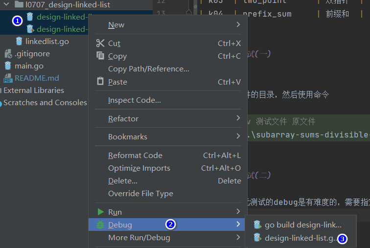

## 介绍

刷刷题，保持一下手感和思维

## 题目分类

| kind | name           | 中文名  |
|------|----------------|------|
| k00  | hash           | 哈希   |
| k01  | binary_search  | 二分查找 |
| k02  | sliding_window | 滑动窗口 |
| k03  | two_point      | 双指针  |
| k04  | prefix_sum     | 前缀和  |


## 如何单元测试(一)

windows下：
进入到test文件的目录，然后使用命令
```bash
# go test -v 测试文件 原文件
go test -v .\subarray-sums-divisible-by-k_test.go .\subarray-sums-divisible-by-k.go
```

## 如何单元测试(二)

windows下单元测试的debug是有难度的，需要指定源文件，否则也会报错说找不到符号等。

方法：选中原文件和测试文件，然后右键Debug即可。

